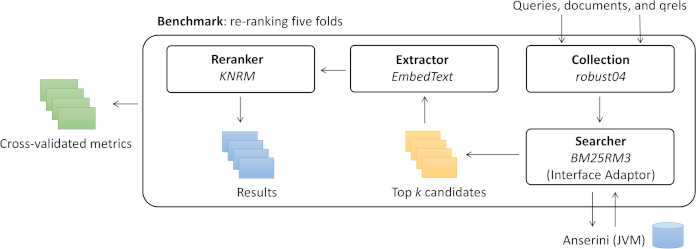

# Running an Experiment with the CLI
Capreolus is primarily intended to be run through its command line interface, which allows the user to specify an experimental pipeline consisting of a first stage ranking method (e.g., BM25), called a `searcher` module, followed by a neural `reranker` module (e.g., KNRM). A `benchmark` module specifies the document collection and folds to use for cross-validation.

Capreolus takes a functional approach to describing an experimental pipeline. A pipeline is a set of configuration options specifying both classes to use for each of these module types (e.g., `searcher=bm25 reranker=KNRM collection=robust04 benchmark=robust04.title.wsdm20demo`) and configuration options associated with each module (e.g., `k1=0.9 b=0.4` for the BM25 searcher). These configuration options fully and deterministically describe the pipeline; the output should always be the same given the same configuration options. Capreolus takes advantage of this functional approach to cache intermediate outputs (given the reranking dataflow).

Capreolus constructs results and cache paths that encode all configuration options that can affect the experiment's output. While this leads to long paths, it makes them human-interpretable and eliminates the need for an external database mapping result paths to the configs used to produce them.



## Commands
The CLI takes a command to run, such as the `train`, and optionally a list of configuration options for the command:
`capreolus <command> [with <configuration options>]`. If no command is specified, `train` is used as the default. Configuration options are specified in `key=value` format.

### Train Command
The `train` command trains a reranking model for `niters` iterations on a single training set. This command displays the *results path*, where the experiment's output will be stored, at the beginning of training. As described above, this (long) path is a combination of a root directory and a string encoding all configuration options influencing the expriment's output. The root directory is indicated by the `$CAPREOLUS_RESULTS` environment variable and defaults to `results/` if unset.

**Example:**
`capreolus train with reranker=KNRM niters=10 benchmark=robust04.title.wsdm20demo fold=s1`

For datasets that use cross-validation (rather than dedicated training and test sets), it is necessary to train the reranking model on each fold separately. A bash `for` loop can be used to do this:

```
export CFG="reranker=KNRM niters=10 benchmark=robust04.title.wsdm20demo"
for FOLDIDX in s1 s2 s3 s4 s5; do
  capreolus train with $CFG fold=$FOLDIDX
done
```

The weights from the best iteration, as measured by nDCG@20 on the dev set, are saved for later use. These are available in `<results path>/weights/dev`.

After each iteration, the current weights are used to rank all documents in the dev and test sets, and these rankings are saved to the results directory. For example, `<results path>/predict/dev/0` is a TREC run file produced by rankingthe dev set queries after the first training iteration. 

Plots of the training loss and dev set performance over the training iterations are saved to `<results path>/info/loss.pdf` and `<results path>/predict/dev.pdf`, respectively.

### Evaluate Command
The `evaluate` command calculates metrics for a reranker that has been trained over the required folds with the `train` command. This is accomplished by retrieving a list of folds from the benchmark and using them to calculate metrics for the searcher and reranker. This command always operates over all folds defined by the benchmark. If a `fold` config option is provided, it will be ignored.

**Example:**
`capreolus evaluate with reranker=KNRM niters=10 benchmark=robust04.title.wsdm20demo`
```
...
2020-01-01 17:55:31 - INFO - capreolus.evaluate - [searcher] avg P_20: 0.397
2020-01-01 17:55:31 - INFO - capreolus.evaluate - [reranker] avg P_20: 0.354
2020-01-01 17:55:31 - INFO - capreolus.evaluate - [interpolated] avg P_20: 0.406
...
```

### Utility Commands
`choices`: print the module classes registered for each module type (i.e., the available modules)
```
$ capreolus choices
<module>             <name>
reranker             CDSSM
reranker             ConvKNRM
...
```

`print_config`: print the current config options given the config string provided (if any) and module defaults. Note that each module class declares its own config options, like `k1` with BM25 or the original query weight `ow` with RM3. This command is helpful for determining what config options are available given a choice of module classes, as illustrated below.

Reranking BM25 with DRMM:
```
$ capreolus print_config with reranker=DRMM searcher=bm25rm3
Configuration (modified, added, typechanged, doc):
...
fold = 's1'
b = 0.4
k1 = 0.9
gateType = 'IDF'                   # term gate type: 'TV' or 'IDF'
histType = 'LCH'                   # histogram type: 'CH', 'NH' or 'LCH'
...
```

Reranking BM25 with PACRR:
```
$ capreolus print_config with reranker=PACRR searcher=bm25
...
fold = 's1'
b = 0.4
k1 = 0.9
maxgram = 3                        # maximum length of ngram used
mingram = 1                        # minimum length of ngram used
nfilters = 32                      # number of filters in convolution layer
...        
```


## Workflow
A typical workflow is as follows:
1. Ensure the `CAPREOLUS_RESULTS` and `CAPREOLUS_CACHE` environment variables are set. (If you are verifying your prior results, you may wish to set these to new locations to ensure a complete replication. Otherwise cached objects, like tokenized documents, may be re-used.)
2. Run the desired `capreolus` command once for each fold. For example, after setting `$CFG`:
`for FOLDIDX in s1 s2 s3 s4 s5; do capreolus with fold=$FOLDIDX $CFG; done` <br/>
The result of this command is *(a)* one reranker model per fold trained on the training queries and *(b)* document (re)rankings for the dev and test queries in each fold for each training iteration.
3. Calculate ranking metrics: `capreolus evaluate with $CFG`.
This command uses the per-fold rankings output from the previous step to calculate metrics.
